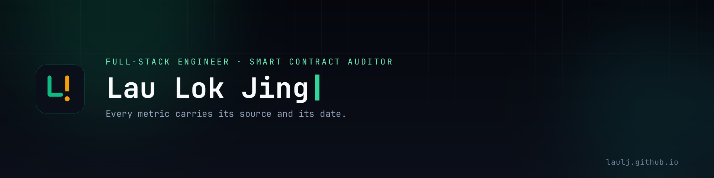

  

# ⚡ Lau Lok Jing · Full-Stack Developer & Smart Contract Auditor

  
  
  
  

## 🛡️ Core Philosophy

> *"Writing secure, simple code matters more than feature-heavy, library-dependent designs. Security always comes before productivity."*

## 📊 Audit Record

| Engagement | Outcome | Status |
|------------|---------|--------|
| **0xMarkets** — competitive audit (2026) | Reported privately to the team. The engagement's terms do not permit publishing the report, so the findings and their severities stay confidential | ✅ Completed |
| **Uniswap V3 Core + Periphery** — independent audit (2026) | Review of concentrated liquidity: flash-loan reentrancy paths, multi-hop swap integrity, and the trade-offs gas-efficient designs force. Every hypothesis reproduced in Foundry before it was written down | ✅ [Report published](https://github.com/laulj/audit-reports) |

## 🛠️ Tech Stack

| Layer | Tools |
|-------|-------|
| **Smart contracts** | `Solidity` · `Foundry` · `OpenZeppelin` · `Chainlink` |
| **Security** | `Slither` · `Invariant & stateful fuzzing` · `forge coverage` · `Manual review` |
| **Backend & data** | `Node.js` · `TypeScript` · `Express` · `SQLite (WAL)` · `REST + WebSockets` |
| **Frontend** | `React 19` · `Vite` · `Tailwind CSS 4` · `Ant Design` · `TanStack Query` · `GSAP` |
| **Tooling & infra** | `Linux` · `Docker` · `GitHub Actions` · `Dedicated blockchain nodes` |

## 🚀 Featured Projects

| Project | Description | Stack | Links |
|---------|-------------|-------|-------|
| **Efeng Spine Healing Center** | A real client's clinic site in Shah Alam: built in 2023, carried through three releases, then rebuilt in 2026 to retire Create React App, Ant Design, Bootstrap and React Spring | React Router 7, Vite, Tailwind CSS 4, Netlify | [Live site](https://efengspine.com) · *client-owned; source private* |
| **TradeOps Nexus** | Self-hosted arbitrage PnL platform: spot, perpetual-futures and funding-rate positions from CEX and DEX venues consolidated into one ledger, behind a custom aggregate cache that ingestion writes invalidate | React 19, Vite, Express, SQLite | [Repo](https://github.com/laulj/tradeops-nexus) · [Live demo](https://tradeops-nexus.onrender.com) |
| **dUSD Stablecoin** | Over-collateralised stablecoin with a liquidation engine; the test suite includes invariant tests that try to break the solvency accounting | Solidity, Foundry, Chainlink | [Repo](https://github.com/laulj/dUSD-stablecoin) |
| **Audit Reports** | A public record of my audit work: the Uniswap V3 review, an on-chain exploit analysis, and the Cyfrin Updraft course reports | Solidity, Foundry, Slither | [Reports](https://github.com/laulj/audit-reports) |
| **Merkle Airdrop** | Gas-efficient token distribution via Merkle proofs, so a claim costs a proof rather than on-chain storage | Solidity, Foundry | [Repo](https://github.com/laulj/merkle-airdrop) |
| **Portfolio Site** | A provenance-first portfolio: the data layer refuses to render a metric without a stated source and a date, and CI fails the build if either half is missing | React 19, Vite, GSAP, GitHub Actions | [Site](https://laulj.github.io/) · [Source](https://github.com/laulj/laulj.github.io) |

*The live dashboard starts empty — sign in with `userDemo` / `demo123`, a shared sample account with three years of history.*

## 🎓 Certifications & Education

- **Solidity Smart Contract Developer & Auditor** — Cyfrin Updraft (2025–2026) · [course audit reports](https://github.com/laulj/audit-reports)
- **ACCR system — IEEE publication, 89.20% accuracy** (2024) · [IEEE Xplore](https://ieeexplore.ieee.org/document/10607358)
- **CS50's Web Programming with Python & JavaScript** — HarvardX (2022–2023) · [certificate](https://certificates.cs50.io/a6fe673a-4dd0-4ce3-97d7-6d6c16f582c5.pdf?size=A4)
- **CS50's Introduction to Computer Science** — HarvardX (2023) · [certificate](https://courses.edx.org/certificates/d3d6c984cc294d3b8efaa040aa16a39f)
- **B.Eng. Electrical & Electronics Engineering** — TARUMT (2022), GPA 3.65/4.0 · [certificate (PDF)](https://laulj.github.io/EEBachelorDegCertificate.pdf)

## 📈 Where the Numbers Live

The figures on this page are the durable ones: a published paper, a degree, an audit record. Engineering metrics move as the code moves, so they are not copied here — they live in one place, each carrying its source and the date it was last true:

- **[laulj.github.io](https://laulj.github.io/)** — full-stack lens
- **[laulj.github.io/?track=security](https://laulj.github.io/?track=security)** — smart-contract security lens

## 📫 Let's Connect

💬 Open for audit engagements, consulting, or smart contract engineering.

📧 [lok.jing.lau.80@gmail.com](mailto:lok.jing.lau.80@gmail.com) · 🔗 [LinkedIn](https://linkedin.com/in/laulj80)

---

*"Security before productivity."*
